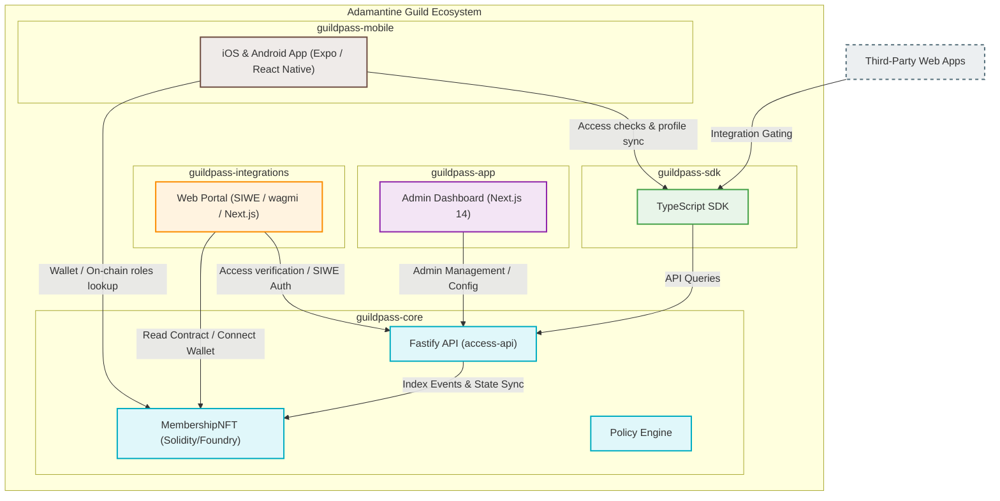

# 🛡️ Adamantine Guild

Welcome to the official repository of the **Adamantine Guild**, a Web3 developer collective building robust, modern, and developer-first membership and token-gating infrastructure for open-source communities, decentralized protocols, and decentralized autonomous organizations (DAOs).

Our primary project is **GuildPass** — a comprehensive suite of Web3 membership protocols, developer tools, frontend applications, and mobile gateways designed to make community governance and access control seamless, secure, and explainable.

---

## 🧭 The GuildPass Ecosystem

GuildPass is divided into specialized repositories that work together to provide end-to-end access control. Click on any repository below to view its source code, architecture, and setup instructions:

| Repository | Purpose | Primary Stack | Key Features |
| :--- | :--- | :--- | :--- |
| [**`guildpass-core`**](https://github.com/Adamantine-Guild/guildpass-core) | The protocol foundation, database backend, Solidity smart contracts, and access policy engine. | Solidity, Foundry, Fastify, Prisma, PostgreSQL, Redis | • Multi-community `MembershipNFT`<br>• Real-time, explainable access API<br>• Local development database seeding |
| [**`guildpass-app`**](https://github.com/Adamantine-Guild/guildpass-app) | A web-based management dashboard for community creators and administrators. | Next.js 14, Tailwind CSS, pnpm Workspaces | • Activity/audit logs<br>• Real-time community & pass management<br>• Out-of-the-box offline mock mode |
| [**`guildpass-integrations`**](https://github.com/Adamantine-Guild/guildpass-integrations) | The primary member-facing portal and portal admin experiences. | Next.js 14, wagmi, viem, TanStack Query | • EIP-4361 (SIWE) gasless authentication<br>• Web3 connect workflows & wallet-aware UI<br>• Granular role-gated experiences |
| [**`guildpass-mobile`**](https://github.com/Adamantine-Guild/guildpass-mobile) | The official iOS and Android native companion application for on-the-go gating. | React Native, Expo Router, Zustand, NativeWind | • Mobile membership wallet<br>• Dynamic offline-ready caching<br>• Instant membership and role verification |
| [**`guildpass-sdk`**](https://github.com/Adamantine-Guild/guildpass-sdk) | The official developer library for checking access and integrating the protocol. | TypeScript, tsup, Vitest | • Tiny footprint, service-based modules<br>• Comprehensive type safety<br>• Node.js, Edge, and browser compatible |

---

## 🏗️ System Architecture

The diagram below shows how the components of the GuildPass ecosystem communicate with each other, with on-chain Ethereum smart contracts, and with external developer applications.



---

## ⚡ Core Technical Pillars

Our engineering philosophy focuses on building modular, decentralized, and explainable systems. The GuildPass protocol implements these four pillars across its codebases:

### 1. Multi-Community Membership Contracts (`MembershipNFT`)
Unlike traditional ERC-721 token gating that requires a new deployed smart contract for every community, our Solidity protocol supports **multi-community mapping** on a single deployed contract. It supports standard EVM chain operations alongside expiry and suspension semantics, allowing community managers to grant, revoke, or renew roles gaslessly off-chain or through on-chain transactions.

### 2. Sign-in with Ethereum (SIWE / EIP-4361)
Administrative mutations and sensitive reads are secured by cryptographically signed messages instead of standard API keys or database passwords. By leveraging EIP-4361, admins sign a gasless message on their wallets to verify ownership, which generates short-lived session tokens for subsequent client requests.

### 3. Decoupled & Explainable Policy Engine
Access policies shouldn't be a black box. The platform incorporates a dedicated access rule engine which determines access permission based on rules such as `PUBLIC`, `MEMBERS_ONLY`, `ADMINS_ONLY`, and custom developer-defined overrides. When a request is made, the engine returns not just a boolean `allowed`/`denied` value, but also human-readable and machine-readable reasons specifying why access was permitted or blocked.

### 4. Lightweight Developer Integration
Security only works if developers use it. The `@guildpass/sdk` features service-specific modules (`client.access`, `client.membership`, `client.roles`, `client.guilds`) so that you only bundle and load the features you need. It supports all standard Node, browser, and Vercel/Cloudflare Edge runtimes.

---

## 🛠️ Getting Started with Development

Each workspace contains a comprehensive guide in its respective directory. Here is a high-level overview of how to spin up the entire suite:

### 1. Set up the Core Services
First, spin up the backend protocol, API database, and contracts:
```bash
cd guildpass-core
docker compose up -d                        # Start PostgreSQL and Redis
npm install
cp .env.example .env                       # Edit DATABASE_URL and REDIS_URL
npm run -w access-api prisma:migrate       # Apply schema changes
npm run seed                               # Seed the DB with mock profiles
npm run dev                                # Run the Fastify API (http://localhost:3000)
```

### 2. Run the Management Dashboard
In another terminal, start the administration interface:
```bash
cd guildpass-app
pnpm install
cp .env.example .env
pnpm dev                                   # Launches Docusaurus, App, and bot
```

### 3. Spin up the Front-End Client
To view the web client portal (where users connect their wallets and authenticate with SIWE):
```bash
cd guildpass-integrations
npm install
cp .env.example .env.local
NEXT_PUBLIC_MOCK_MODE=true npm run dev     # Run in mock/demo mode (or point to live core)
```

### 4. Launch the Mobile Companion
Run the React Native / Expo application:
```bash
cd guildpass-mobile
pnpm install
cp .env.example .env
pnpm start                                 # Scan the QR code using Expo Go on iOS/Android
```

---

## 🤝 Contributing to Adamantine Guild

We welcome contributions from the community! Whether you are a Solidity wizard, React Native developer, or writer, there is a place for you in our guild.

1. Find issues tagged **`good first issue`** or **`help wanted`** across our repositories.
2. Fork the repository, create a descriptive branch name, and implement your changes.
3. Open a Pull Request referencing the issue you addressed. Please ensure all lint checks (`npm run lint`) and type checks (`npm run typecheck`) pass before submitting.

### Get in Touch
If you have any questions, ideas, or feedback, feel free to reach out to the project maintainers:
* **Email**: cerealboxx123@gmail.com
* **Official Website**: [guildpass.xyz](https://guildpass.xyz)
* **GitHub Organization**: [Adamantine-Guild](https://github.com/Adamantine-Guild)

---

<div align="center">
  <p>Crafted with care and precision by the <b>Adamantine Guild</b> core maintainers</p>
  <a href="https://guildpass.xyz">guildpass.xyz</a>
</div>